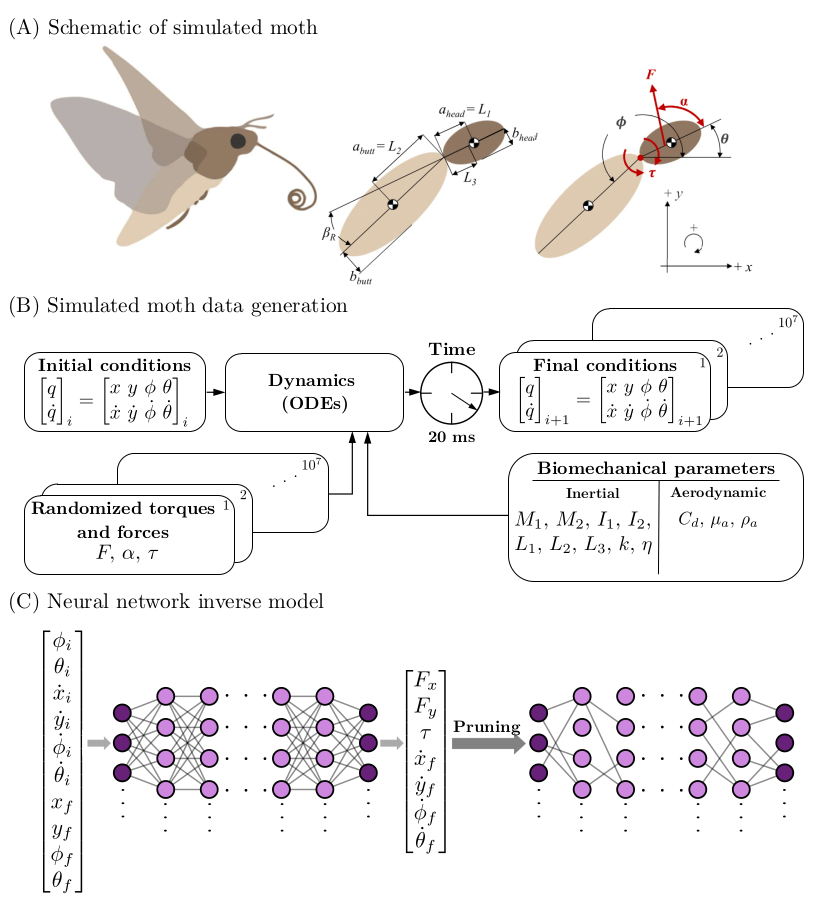
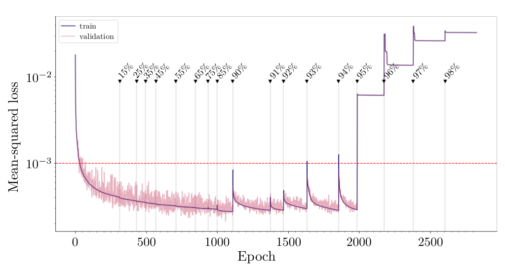

# MothPruning

## Scientific Overview 
Originally inspired by biological nervous systems, deep neural networks (DNNs) are powerful computational tools for modeling complex systems. DNNs are used in a diversity of domains and have helped solve some of the most intractable problems in physics, biology, and computer science. Despite their prevalence, the use of DNNs as a modeling tool comes with some major downsides. DNNs are highly overparameterized, which often results in them being difficult to generalize and interpret, as well as being incredibly computationally expensive. Unlike DNNs, which are often trained until they reach the highest accuracy possible, biological networks have to balance performance with robustness to a noisy and dynamic environment. Biological neural systems use a variety of mechanisms to promote specialized and efficient pathways capable of performing complex tasks in the presence of noise. One such mechanism, synaptic pruning, plays a significant role in refining task-specific behaviors. Synaptic pruning results in a more sparsely connected network that can still perform complex cognitive and motor tasks. Here, we draw inspiration from biology and use DNNs and the method of neural network pruning to find a sparse computational model for controlling a biological motor task. 

In this work, we use the inertial dynamics model in [[2]](#2) to simulate examples of *M. sexta* hovering flight. These data are used to train a DNN to learn the controllers for hovering. Drawing inspiration from pruning in biological neural systems, we sparsify the network using neural network pruning. Here, we prune weights based simply on their magnitudes, removing those weights closest to zero. Insects must maneuver through high noise environments to accomplish controlled flight. It is often assumed that there is a trade-off between perfect flight control and robustness to noise and that the sensory data may be limited by the signal-to-noise ratio. Thus the network need not train for the most accurate model since in practice noise prevents high-fidelity models from exhibiting their underlying accuracy. Rather, we seek to find the sparsest model capable of performing the task given the noisy environment. We employed two methods for neural network pruning: either through manually setting weights to zero or by utilizing binary masking layers. Furthermore, the DNN is pruned sequentially, meaning groups of weights are removed slowly from the network, with retraining in-between successive prunes, until a target sparsity is reached. Monte Carlo simulations are also used to quantify the statistical distribution of network weights during pruning given random initialization of network weights.

For more information, please see our [paper](https://journals.plos.org/ploscompbiol/article?id=10.1371/journal.pcbi.1010512) [[1]](#1). 



## Project Description

The deep, fully-connected neural network was constructed with ten input variables and seven output variables. The initial and final state space conditions are the inputs to the network: <sub>*i*</sub>, <sub>*i*</sub>, 
<sub>*i*</sub>, <sub>*i*</sub>, <sub>*i*</sub>, <sub>*i*</sub>, 
<sub>*f*</sub>,
<sub>*f*</sub>, <sub>*f*</sub>, and <sub>*f*</sub>. The network predicts the control variables and the final derivatives of the state space in its output layer: <sub>*x*</sub>, <sub>*y*</sub>, , <sub>*f*</sub>, <sub>*f*</sub>, <sub>*f*</sub>, and <sub>*f*</sub>.

After the fully-connected network is trained to a minimum error, we used the method of neural network pruning to promote sparsity between the network layers. In this work, a target sparsity (percentage of pruned network weights) is specified and the smallest magnitude weights are forced to zero. The network is then retrained until a minimum error is reached. This process is repeated until most of the weights have been pruned from the network.

The training and pruning protocols were developed using Keras with the TensorFlow backend. To scale up training for the statistical analysis of many networks, the training and pruning protocols were parallelized using the Jax framework.

To ensure weights remain pruned during retraining, we implemented the pruning functionality of a TensorFlow built toolkit called the [Model Optimization Toolkit](https://www.tensorflow.org/model_optimization/guide/pruning/comprehensive_guide.md). The toolkit contains functions for pruning deep neural networks. In the Model Optimization Toolkit, pruning is achieved through the use of binary masking layers that are multiplied element-wise to each weight matrix in the network.

To be able to train and analyze many neural networks, the training and pruning protocols were parallelized in the Jax framework. Jax however does not come with a toolkit for pruning, therefore pruning by way of the binary masking matrices was coded into the training loop.

## Installation

Create new conda environment with tools for generating data and training network *(Note that this environment requires a GPU and the correct NVIDIA drivers).*

```
conda env create -f environment_ODE_DL.yml
```

Create kernelspec (so you can see this kernel in JupyterLab).

```
conda activate [environment name]
python -m ipykernel install --user --name [environment name]
conda deactivate
```

To install Jax and Flax please follow the instructions on the [Jax Github](https://github.com/google/jax#installation). 

## Data

To use the TensorFlow version of this code, you need to gerenate simulations of moth hovering for the data. The Jax version (multi-network train and prune) has data provided in this repository.

```
cd MothMachineLearning/Underactuated/GenerateData

```
and use `010_OneTorqueParallelSims.ipynb ` to generate the simulations. 

## How to use

The following guide walks through the process of training and pruning many networks in parallel using the Jax framework. However, the TensorFlow code is also provided for experimentation and visualization. 

### Step 1: Train networks 

```
cd MothMachineLearning/Underactuated/TrainNetwork/multiNetPrune/
```

First we train and prune the desired number of networks in parallel using the Jax framework. Choose the number of networks you wish to train/prune in parallel by adjusting the `numParallel` parameter. You can also define the number of layers, units, and other hyperparameters. Use the command 

```
python3 step1_train.py
```
to train and prune the networks in parallel. 

### Step 2: Evaluate at prunes

Next, the networks need to be evaulated at each prune. Use the command
```
python3 step2_pruneEval.py
```
to evaluate the networks at each prune. 

### Step 3: Pre-process networks 

This code prepares the networks for sparse network identification (explained in the next step). It essentially just reorganizes the data. Open and run `step3_preprocess.ipynb` to preprocess, making sure to change `modeltimestamp` and the file names to the correct ones for your run.

### Step 4: Find sparse networks 

This codes finds the optimally sparse networks. For each network, the most pruned version whose loss is below a specified threshold (here 0.001) is kept. For example, the image below is a single network that has gone through the sequential pruning process and the red line specifies the defined threshold. For this example, the optimally sparse network is the one pruned by 94% (i.e. 6% of the original weights remain). 



The sparse networks are collected and saved to a file called `sparseNetworks.pkl`. Open and run `step4_findSparse.ipynb`, making sure to change `modeltimestamp` and the file names to the correct ones for your run.

*Note that if a network does not have a single prune that is below the loss threshold, it will be skipped and not included in the list of* `sparseNetworks`. *For example, if you trained and pruned 10 networks and 3 did not have a prune below a loss of 0.001, the list* `sparseNetworks` *will be length 7.*

## References
<a id="1">[1]</a> 
Zahn, O., Bustamante, Jr J., Switzer, C., Daniel, T., and Kutz, J. N. (2022). 
Pruning deep neural networks generates a sparse, bio-inspired nonlinear controller for insect flight. 

<a id="2">[2]</a> 
Jorge Bustamante, Jr, Mahad Ahmed, Tanvi Deora, Brian Fabien, Thomas L Daniel, Abdominal Movements in Insect Flight Reshape the Role of Non-Aerodynamic Structures for Flight Maneuverability I: Model Predictive Control for Flower Tracking, Integrative Organismal Biology, Volume 4, Issue 1, 2022, obac039, https://doi.org/10.1093/iob/obac039
